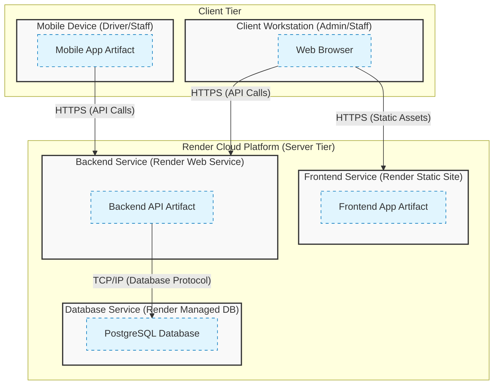

# Chương: Kiến Trúc Hệ Thống

Tài liệu này mô tả chi tiết kiến trúc tổng thể của hệ thống Điểm danh nhận diện khuôn mặt (DOANTN). Hệ thống được thiết kế theo mô hình **Client-Server** hiện đại, sử dụng containerization để dễ dàng triển khai và mở rộng.

## 1. Mô hình Kiến trúc

Hệ thống được xây dựng theo mô hình **Kiến trúc 3 Lớp (3-Tier Architecture)** kết hợp với mô hình **Client-Server**. Đây là mô hình tiêu chuẩn, đảm bảo tính tách biệt giữa giao diện, xử lý nghiệp vụ và lưu trữ dữ liệu.

### Chi tiết 3 lớp:

1.  **Lớp Giao diện (Presentation Layer)**:
    - Bao gồm **Mobile App** (React Native) cho nhân viên và **Web Frontend** (ReactJS) cho quản trị viên.
    - Chịu trách nhiệm hiển thị thông tin và tương tác với người dùng.
2.  **Lớp Nghiệp vụ (Application/Business Layer)**:
    - Là **Backend API** (Django).
    - Chứa toàn bộ logic xử lý: xác thực, chấm công, và xử lý dữ liệu.
3.  **Lớp Dữ liệu (Data Layer)**:
    - Là hệ quản trị cơ sở dữ liệu **PostgreSQL**.
    - Lưu trữ, truy xuất và đảm bảo toàn vẹn dữ liệu.

### Lưu ý về mẫu thiết kế (Design Patterns):

Mặc dù kiến trúc tổng thể là **3-Tier**, nhưng bên trong từng thành phần sẽ áp dụng các mẫu thiết kế phần mềm cụ thể:

- **Backend (Django)**: Sử dụng mô hình **MVT (Model-View-Template)**, đây thực chất là một biến thể của **MVC (Model-View-Controller)**.
  - **Model**: Định nghĩa cấu trúc dữ liệu (`models.py`).
  - **View**: Xử lý logic nghiệp vụ và API (`views.py`, `api.py`) - tương đương với _Controller_ trong MVC truyền thống.
  - **Template**: (Ít dùng trong API) Xử lý hiển thị - tương đương với _View_ trong MVC.
- **Frontend (React)**: Sử dụng mô hình **Component-based Architecture**, coi giao diện là tập hợp các thành phần tái sử dụng.

## 2. Sơ đồ kiến trúc (C4 Container)

Dưới đây là biểu đồ mô tả sự tương tác giữa các thành phần trong hệ thống:

### 2.1. Bản vẽ Deployment Diagram tổng thể

Bản vẽ dưới đây mô tả chi tiết cách thức triển khai các thành phần phần mềm (Artifacts) lên các node vật lý và môi trường thực thi (Nodes).

**Giải thích các thành phần của Deployment Diagram:**

1.  **Nodes (Thành phần vật lý/Môi trường):**
    - **Client Workstation**: Máy tính của nhân viên hoặc quản trị viên, sử dụng trình duyệt web.
    - **Mobile Device**: Thiết bị di động của nhân viên chấm công, chạy ứng dụng React Native.
    - **Frontend Service**: Dịch vụ Static Site trên Render, chuyên phục vụ các file giao diện (HTML/CSS/JS).
    - **Backend Service**: Dịch vụ Web Service trên Render, chạy container Python/Django để xử lý logic.
    - **Database Service**: Dịch vụ PostgreSQL được quản lý bởi Render.

2.  **Artifacts (Thành phần phần mềm):**
    - **Frontend App Artifact**: Mã nguồn ReactJS đã được build.
    - **Mobile App Artifact**: Ứng dụng Android/iOS đã được cài đặt.
    - **Backend API Artifact**: Mã nguồn Django Server.
    - **PostgreSQL Database**: Dữ liệu được lưu trữ.

3.  **Relationships (Quan hệ):**
    - **HTTPS (Static Assets)**: Trình duyệt tải giao diện từ Frontend Service.
    - **HTTPS (API Calls)**: Trình duyệt và Mobile App gọi API trực tiếp tới Backend Service.
    - **TCP/IP**: Kết nối nội bộ giữa Backend Service và Database Service.

## 3. Chi tiết các thành phần

### 3.1. Web Frontend (`/frontend`)

- **Công nghệ**: React 19.2.0, Vite 7.2.4, Bootstrap 5.3.8.
- **Thư viện chính**:
  - `react-router-dom`: Điều hướng trang.
  - `axios`: Giao tiếp với Backend API.
  - `chart.js` / `react-chartjs-2`: Vẽ biểu đồ báo cáo.
- **Chức năng**: Cung cấp giao diện người dùng trực quan cho quản trị viên.
  - Quản lý danh sách nhân viên, phòng ban.
  - Xem lịch sử chấm công, xuất báo cáo.
  - Cấu hình hệ thống.
- **Triển khai**: Đóng gói dưới dạng static files và được phục vụ thông qua Render Frontend/Web Service.

### 3.2. Mobile App (`/mobile`)

- **Công nghệ**: React Native 0.81.5 (Expo SDK 54).
- **Thư viện chính**:
  - `expo-camera`: Thư viện camera (Dự phòng cho tính năng tương lai).
  - `expo-location`: Lấy tọa độ GPS.
  - `@react-navigation/native`: Điều hướng màn hình.
- **Chức năng**:
  - Xem thống kê chuyên cần, lịch sử ra vào.
  - Nhận thông báo từ hệ thống.
  - Quản lý thông tin cá nhân.
- **Giao tiếp**: Kết nối trực tiếp với Backend API thông qua Internet.

### 3.3. Backend API (`/backend`)

- **Công nghệ**: Python, Django 5.2.5, Django REST Framework 3.16.1.
- **Máy chủ ứng dụng**: Gunicorn 23.0.0.
- **Mô hình AI**: Tích hợp sẵn cơ sở hạ tầng để mở rộng xử lý ảnh trong tương lai (InsightFace Ready).
- **Vai trò**: "Bộ não" của hệ thống, xử lý toàn bộ logic nghiệp vụ.
- **Các module chính**:
  - **Auth Service**: Xác thực người dùng (JWT).
  - **Attendance Service**: Xử lý logic chấm công và tính toán thống kê.
  - **Management Service**: API CRUD cho nhân viên và phòng ban.

### 3.4. Database

- **Công nghệ**: PostgreSQL 15.
- **Vai trò**: Lưu trữ bền vững (Persistent Storage) cho toàn bộ hệ thống.
- **Dữ liệu**: Thông tin nhân viên, lịch sử chấm công, cấu hình hệ thống.
- **Bảo mật**: Hosting trên Render, chỉ cho phép services nội bộ truy cập (nếu cấu hình private).

## 4. Mô hình Triển khai (Deployment)

Hệ thống được triển khai trên nền tảng đám mây **Render**.

- **Backend & Frontend**: Được host dưới dạng Web Services trên Render, tự động build và deploy từ GitHub.
- **Database**: Sử dụng PostgreSQL Service được quản lý bởi Render.
- **Bảo mật**: Render tự động cung cấp chứng chỉ SSL (HTTPS) và bảo vệ chống DDoS, Load Balancing.
